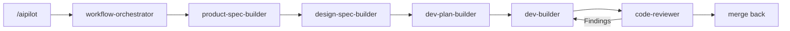

<p align="center">
  
</p>

<h1 align="center">AIPilot</h1>

<p align="center">
  A document-driven, stage-gated product development workflow for coding agents.
</p>

<p align="center">
  
  
  
</p>

<p align="center">
  English | <a href="documents/README_zh-CN.md">中文</a> | <a href="documents/README_ja-JP.md">日本語</a> | <a href="documents/README_es-ES.md">Español</a>
</p>

AIPilot is a suite of specialized workflow skills for AI coding agents that automates and structures daily software development. It turns product work into an inspectable, stage-gated process: defining requirements, making design decisions, creating executable plans, implementing changes, reviewing results, and merging approved updates back into project documentation. Starting from a single entry point, AIPilot automatically inspects project state and routes work to the right skill.

Paired with [ezreview](https://github.com/JililiDD/ezreview), AIPilot renders Markdown documents as interactive HTML pages for in-browser review. You can annotate specific headings, paragraphs, and interface elements directly in your browser; AIPilot applies your feedback to the Markdown source, reloads the HTML preview, and maintains the review loop until final approval.

## Install AIPilot

### Claude Code

```bash
claude plugin marketplace add JililiDD/aipilot
claude plugin install aipilot@aipilot
```

### Codex

```bash
codex plugin marketplace add JililiDD/aipilot
codex plugin add aipilot@aipilot
```

### Grok Build

```bash
grok plugin install JililiDD/aipilot@v1.1.1 --trust
```

## Use one entry point

You don't need to pick a skill manually. The `workflow-orchestrator` reads the current project state, recovers interrupted bookkeeping, and automatically routes work to the right skill for each stage.

Start or resume work using a slash command or natural language prompt:

```text
/aipilot Build a TODO list app
```
*or*
```text
Use AIPilot to build a TODO list app.
```



## Review documents in HTML with ezreview (optional)

AIPilot pairs with [ezreview](https://github.com/JililiDD/ezreview) to provide an interactive browser-based review loop for product specs, design specs, plans, and UI prototypes.

1. **Zero-token rendering:** AIPilot converts the Markdown source into a temporary HTML file using [marked](https://github.com/markedjs/marked) without consuming API tokens.
2. **In-browser annotation:** `ezreview` opens the page with annotation tools, letting you attach comments to specific headings, paragraphs, or interface elements.
3. **Automated updates:** AIPilot applies your feedback directly to the Markdown source, replies to annotations, and reloads the HTML preview for another pass.
4. **Approval & cleanup:** The loop repeats until you grant final approval. Markdown remains the single source of truth—temporary HTML files are cleaned up from the session scratchpad when the review closes (or retained as visual design deliverables).

## Know what each skill does

The workflow orchestrator automatically selects these skills based on project state, but you can also invoke any skill directly when needed.

| Skill | Responsibility |
| --- | --- |
| [`workflow-orchestrator`](skills/workflow-orchestrator/SKILL.md) | Orchestrates workflow stages, tracks project state, manages confirmation gates, and merges approved work |
| [`product-spec-builder`](skills/product-spec-builder/SKILL.md) | Clarifies requirements, scope, behavior, data boundaries, and acceptance criteria through structured interviews |
| [`design-spec-builder`](skills/design-spec-builder/SKILL.md) | Translates visual direction into concrete layout, typography, component interaction, and design decisions |
| [`dev-plan-builder`](skills/dev-plan-builder/SKILL.md) | Builds executable phase roadmaps with ordered tasks, reuse strategies, and verification test plans |
| [`dev-builder`](skills/dev-builder/SKILL.md) | Implements approved plans, collects execution evidence, and diagnoses root causes on test/build failures |
| [`code-reviewer`](skills/code-reviewer/SKILL.md) | Conducts fresh-context code reviews against product specs, design guidelines, implementation plans, and tests |
| [`release-builder`](skills/release-builder/SKILL.md) | Verifies packaging, permissions, privacy compliance, release notes, and deployment readiness |
| [`note-keeper`](skills/note-keeper/SKILL.md) | Records architectural decisions, discovered pitfalls, and project guidelines into persistent memory |
| [`java-backend-expert`](skills/java-backend-expert/SKILL.md) | Provides specialized Spring Boot, REST API, JPA/SQL, and JVM architecture judgment across all stages |

## Keep project memory between conversations

AIPilot stores durable context in project documents. The workflow orchestrator reads the memory files when a later session starts.

### `memory/decisions.md` records choices that shape future work

Use `memory/decisions.md` for technical or architectural choices that constrain future implementation and are not already clear in the product or design specs. Examples include a service boundary, persistence strategy, authentication model, transaction boundary, or a decision that changes the product's long-term design direction.

A decision remains history even when the project replaces it. A later entry supersedes the old choice instead of rewriting the record.

### `memory/lessons.md` records constraints and pitfalls

Use `memory/lessons.md` for facts discovered through implementation, diagnosis, or integration work. Examples include a third-party API limitation, an undocumented SDK behavior, a build-system trap, a platform permission requirement, or a repository convention that future work must respect.

Lessons prevent later sessions from rediscovering the same failure through another round of debugging.

### `memory/agent-guideline.md` records workflow improvements

Use `memory/agent-guideline.md` for project-specific instructions about how AIPilot should plan, question, stop, review, or report work. These rules change the workflow for this project without changing AIPilot for every repository.

If the workflow has a defect, tell AIPilot what should change and make the intent durable. For example:

```text
For this project, always show API contract changes before writing the implementation plan. Remember this as a workflow rule.
```

## Choose where AIPilot stores project documents

The first AIPilot run initializes the project and asks where its documents should live. Accept `docs/aipilot/` to keep them inside the project, or provide any custom directory.

A custom directory can live inside or outside the repository. For an external documents root, AIPilot can create a project-named subfolder so several projects can share one parent directory. External documents don't travel with Git branches or repository clones, so choose that option only when separate storage is intentional.

AIPilot writes the resolved location into the project-root `AGENTS.md` under an `## AIPilot` heading. Later sessions read that pointer before opening project state. The default layout is:

```text
docs/aipilot/
├── product-spec.md
├── design-spec.md
├── dev-phase-plan.md
├── memory/               # appears when the first memory is recorded
│   ├── decisions.md
│   ├── lessons.md
│   └── agent-guideline.md
├── design-assets/
└── work-items/
    ├── active-change.md
    └── merged/
```

Master specs describe the approved product state. An active work item owns the pending Requirement, Design, Plan, and Execution Record until review finishes. Merge-back updates the master documents and moves the completed work item into `work-items/merged/`.

Cold start creates `work-items/`, `work-items/merged/`, and `design-assets/`. The `memory/` directory remains lazy: the Skill that captures the first memory creates it together with the corresponding Markdown file and required headings.

## Third-party software

AIPilot vendors two MIT-licensed components for offline document review:

- [ezreview](https://github.com/JililiDD/ezreview) `0.2.2` opens reviewable HTML and returns element-anchored annotations
- [marked](https://github.com/markedjs/marked) `18.0.6` renders Markdown without a runtime download

See [`THIRD_PARTY_NOTICES.md`](THIRD_PARTY_NOTICES.md) for source and license details.
