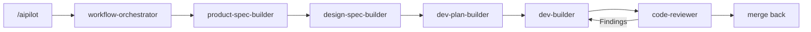

<p align="center">
  
</p>

<h1 align="center">AIPilot</h1>

<p align="center">
  A document-driven product development workflow for coding agents.
</p>

<p align="center">
  
  
  
</p>

AIPilot turns product work into a staged, inspectable process: define the requirement, make design decisions, create an executable plan, implement it, review the result, and merge the approved state back into the project documents. Start from one entry point. AIPilot reads the project state and routes the work to the right skill.

AIPilot pairs with [ezreview](https://github.com/JililiDD/ezreview) to render Markdown documents as reviewable HTML. You can annotate specific headings, paragraphs, and interface elements in the browser. AIPilot applies the feedback to the Markdown source, reloads the HTML, and keeps the review open until you approve or cancel it.

## Install AIPilot

Install the plugin for your coding agent. The next section explains how to enter the workflow.

### Claude Code

Add the marketplace and install the plugin:

```bash
claude plugin marketplace add JililiDD/aipilot
claude plugin install aipilot@aipilot
```

### Codex

Add the marketplace and install the plugin:

```bash
codex plugin marketplace add JililiDD/aipilot
codex plugin add aipilot@aipilot
```

### Grok Build

Add the marketplace and install the plugin:

```bash
grok plugin marketplace add JililiDD/aipilot
grok plugin install aipilot@aipilot
```

For a local checkout, replace `JililiDD/aipilot` with the absolute path to this repository.

## Use one entry point

You don't need to choose a skill before you understand the work. The `workflow-orchestrator` reads the project state, recovers interrupted bookkeeping, and invokes the skills required by the current stage.

Start or resume work in Claude Code and Grok Build:

```text
/aipilot Build an account recovery flow
```

Codex plugins currently can't register an arbitrary slash command such as `/aipilot`. Codex has built-in slash commands, while reusable plugin workflows are exposed as skills. Use the equivalent natural-language entry point:

```text
Use AIPilot to build an account recovery flow.
```



Design is skipped when the work has no user interface. Release readiness is available when the project needs packaging, deployment, public distribution, or a final handoff.

AIPilot pauses at stage boundaries by default. You review the current document before the next skill starts, so a misunderstood requirement doesn't become a completed implementation.

## Review documents in HTML with ezreview

[ezreview](https://github.com/JililiDD/ezreview) adds a browser review loop to product specs, design specs, work items, plans, and HTML design previews. AIPilot vendors the runtime, so document review does not install an npm package or depend on a hosted review service.

The document review loop follows these steps:

1. AIPilot renders the Markdown source into a temporary HTML file
2. ezreview opens the file with annotation controls
3. You attach comments to specific elements and submit the review
4. AIPilot updates the Markdown source and replies to each annotation
5. The browser reloads the same HTML file for another review pass
6. You approve the document or cancel the review

Markdown remains the source of truth. The generated HTML stays in the session scratchpad and is deleted when the review closes. For a visual design prototype, the HTML itself can remain the reviewed deliverable.

The bundled review runtime requires Node.js 20 or newer. If a browser is unavailable, AIPilot keeps the same review gate and collects feedback in chat.

## Know what each skill does

The workflow orchestrator selects these skills from the current project state. You can still invoke one directly when you want a specific capability.

| Skill | Responsibility |
| --- | --- |
| [`workflow-orchestrator`](skills/workflow-orchestrator/SKILL.md) | Starts or resumes AIPilot, reads project state, routes stages, enforces confirmation gates, and merges approved work back into the master documents |
| [`product-spec-builder`](skills/product-spec-builder/SKILL.md) | Interviews you until a product, feature, bug, or refactor has clear scope, behavior, data boundaries, and acceptance criteria |
| [`design-spec-builder`](skills/design-spec-builder/SKILL.md) | Converts vague visual direction into concrete layout, hierarchy, typography, interaction, density, and reference decisions |
| [`dev-plan-builder`](skills/dev-plan-builder/SKILL.md) | Creates phase roadmaps and executable work-item plans with ordered tasks, reuse decisions, tests, and verification methods |
| [`dev-builder`](skills/dev-builder/SKILL.md) | Implements approved plans, records evidence, and switches to diagnosis mode when a failure needs a root cause before another edit |
| [`code-reviewer`](skills/code-reviewer/SKILL.md) | Reviews the diff from a clean context against the requirement, design, plan, tests, and recorded evidence |
| [`release-builder`](skills/release-builder/SKILL.md) | Checks packaging, privacy, permissions, release notes, rollback, known risks, and final release evidence |
| [`note-keeper`](skills/note-keeper/SKILL.md) | Records durable decisions, discovered pitfalls, and project-specific workflow preferences without starting a new stage |
| [`java-backend-expert`](skills/java-backend-expert/SKILL.md) | Adds Spring Boot, REST API, persistence, transaction, validation, Maven, Gradle, and JUnit judgment to planning, building, diagnosis, and review |

## Keep project memory between conversations

AIPilot stores durable context in project documents instead of relying on chat history. The workflow orchestrator reads the memory files when a later session starts.

### `decisions.md` records choices that shape future work

Use `decisions.md` for technical or architectural choices that constrain future implementation and are not already clear in the product or design specs. Examples include a service boundary, persistence strategy, authentication model, transaction boundary, or a decision that changes the product's long-term design direction.

A decision remains history even when the project replaces it. A later entry supersedes the old choice instead of rewriting the record.

### `lessons.md` records constraints and pitfalls

Use `lessons.md` for facts discovered through implementation, diagnosis, or integration work. Examples include a third-party API limitation, an undocumented SDK behavior, a build-system trap, a platform permission requirement, or a repository convention that future work must respect.

Lessons prevent later sessions from rediscovering the same failure through another round of debugging.

### `agent-guideline.md` records workflow improvements

Use `agent-guideline.md` for project-specific instructions about how AIPilot should plan, question, stop, review, or report work. These rules change the workflow for this project without changing AIPilot for every repository.

If the workflow has a defect, tell AIPilot what should change and make the intent durable. For example:

```text
For this project, always show API contract changes before writing the implementation plan. Remember this as a workflow rule.
```

The [`note-keeper`](skills/note-keeper/SKILL.md) skill normalizes that request and records it under `Active Workflow Overrides`. A later session reads the rule and follows it when the same situation occurs. If your wording might apply only to the current task, Note Keeper shows the proposed rule and asks whether to save it.

Product behavior does not belong in `agent-guideline.md`. Put product requirements in `product-spec.md` or the active work item. Put a plugin-wide workflow change in the AIPilot source.

## Choose where AIPilot stores project documents

The first AIPilot run initializes the project and asks where its documents should live. Accept `docs/aipilot/` to keep them inside the project, or provide any custom directory.

A custom directory can live inside or outside the repository. For an external documents root, AIPilot can create a project-named subfolder so several projects can share one parent directory. External documents don't travel with Git branches or repository clones, so choose that option only when separate storage is intentional.

AIPilot writes the resolved location into the project-root `AGENTS.md` under an `## AIPilot` heading. Later sessions read that pointer before opening project state. The default layout is:

```text
docs/aipilot/
├── product-spec.md
├── design-spec.md
├── dev-phase-plan.md
├── decisions.md
├── lessons.md
├── agent-guideline.md
├── design-assets/
└── work-items/
    ├── active-change.md
    └── merged/
```

Master specs describe the approved product state. An active work item owns the pending Requirement, Design, Plan, and Execution Record until review finishes. Merge-back updates the master documents and moves the completed work item into `work-items/merged/`.

## Third-party software

AIPilot vendors two MIT-licensed components for offline document review:

- [ezreview](https://github.com/JililiDD/ezreview) `0.2.1` opens reviewable HTML and returns element-anchored annotations
- [marked](https://github.com/markedjs/marked) `18.0.6` renders Markdown without a runtime download

See [`THIRD_PARTY_NOTICES.md`](THIRD_PARTY_NOTICES.md) for source and license details.
