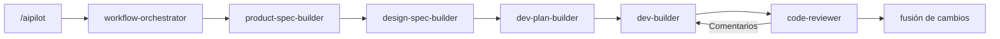

<p align="center">
  
</p>

<h1 align="center">AIPilot</h1>

<p align="center">
  Flujo de trabajo de desarrollo de productos guiado por documentos y fases para agentes de código.
</p>

<p align="center">
  
  
  
</p>

<p align="center">
  <a href="../README.md">English</a> | <a href="README_zh-CN.md">中文</a> | <a href="README_ja-JP.md">日本語</a> | Español
</p>

AIPilot es un conjunto de habilidades de flujo de trabajo especializadas para agentes de código IA que automatiza y estructura el desarrollo diario de software. Convierte el trabajo de producto en un proceso supervisado y dividido en fases: definición de requisitos, toma de decisiones de diseño, creación de planes ejecutables, implementación de cambios, revisión de resultados y fusión de actualizaciones aprobadas en la documentación del proyecto. Partiendo de un único punto de entrada, AIPilot inspecciona automáticamente el estado del proyecto y dirige el trabajo a la habilidad adecuada.

Junto con [ezreview](https://github.com/JililiDD/ezreview), AIPilot renderiza documentos Markdown como páginas HTML interactivas para su revisión en el navegador. Puede añadir anotaciones directamente a encabezados, párrafos y elementos de interfaz; AIPilot aplica sus comentarios al código fuente Markdown, recarga la vista previa HTML y mantiene el ciclo de revisión hasta su aprobación final.

## Instalación de AIPilot

### Claude Code

```bash
claude plugin marketplace add JililiDD/aipilot
claude plugin install aipilot@aipilot
```

### Codex

```bash
codex plugin marketplace add JililiDD/aipilot
codex plugin add aipilot@aipilot
```

### Grok Build

```bash
grok plugin install JililiDD/aipilot@v1.0.0 --trust
```

## Uso de un único punto de entrada

No necesita elegir una habilidad manualmente. El `workflow-orchestrator` lee el estado actual del proyecto, recupera registros interrumpidos y dirige automáticamente el trabajo a la habilidad adecuada para cada fase.

Inicie o reanude el trabajo utilizando un comando de barra inclinada (slash command) o una instrucción en lenguaje natural:

```text
/aipilot Construir una aplicación de lista de tareas TODO
```
*o*
```text
Usar AIPilot para construir una aplicación de lista de tareas TODO.
```

En **Codex**, seleccione AIPilot en la lista de plugins o elija `Aipilot: Workflow Orchestrator` como punto de entrada.



* **Enrutamiento inteligente de fases:** El diseño visual (`design-spec-builder`) se omite automáticamente en tareas sin interfaz de usuario. La preparación de lanzamiento (Release Readiness) se habilita cuando se requiere empaquetado, despliegue, distribución pública o entrega final.
* **Revisión con control humano:** AIPilot se detiene por defecto en las fronteras entre fases, permitiéndole revisar cada documento antes de que comience la siguiente habilidad para que un requisito mal entendido nunca se convierta en una implementación errónea.

## Revisión de documentos en HTML con ezreview (opcional)

AIPilot se integra con [ezreview](https://github.com/JililiDD/ezreview) para proporcionar un ciclo de revisión interactivo en el navegador para especificaciones de producto, especificaciones de diseño, planes y prototipos de interfaz.

1. **Renderizado sin consumo de tokens:** AIPilot convierte el código fuente Markdown en un archivo HTML temporal localmente mediante [marked](https://github.com/markedjs/marked) sin consumir tokens de la API.
2. **Anotaciones en el navegador:** `ezreview` abre la página con herramientas de anotación, permitiéndole adjuntar comentarios a encabezados, párrafos o elementos de interfaz específicos.
3. **Actualización automatizada:** AIPilot aplica sus comentarios directamente al código fuente Markdown, responde a las anotaciones y recarga la vista previa HTML para otra ronda de revisión.
4. **Aprobación y limpieza:** El ciclo se repite hasta que otorgue la aprobación final. Markdown sigue siendo la única fuente de verdad: los archivos HTML temporales se eliminan del borrador de la sesión al cerrar la revisión (o se conservan si se requieren como entregables de diseño visual).

## Descripción de cada habilidad

El orquestador de flujo de trabajo selecciona automáticamente estas habilidades según el estado del proyecto, pero también puede invocar cualquier habilidad directamente cuando lo necesite.

| Habilidad | Responsabilidad |
| --- | --- |
| [`workflow-orchestrator`](../skills/workflow-orchestrator/SKILL.md) | Orquesta las fases del flujo de trabajo, rastrea el estado del proyecto, gestiona las puertas de confirmación y fusiona el trabajo aprobado |
| [`product-spec-builder`](../skills/product-spec-builder/SKILL.md) | Aclara requisitos, alcance, comportamiento, límites de datos y criterios de aceptación mediante entrevistas estructuradas |
| [`design-spec-builder`](../skills/design-spec-builder/SKILL.md) | Traduce la dirección visual en diseño de distribución, tipografía, interacción de componentes y decisiones de diseño concretas |
| [`dev-plan-builder`](../skills/dev-plan-builder/SKILL.md) | Construye hojas de ruta ejecutables por fases con tareas ordenadas, estrategias de reutilización y planes de pruebas de verificación |
| [`dev-builder`](../skills/dev-builder/SKILL.md) | Implementa planes aprobados, recopila evidencias de ejecución y diagnostica causas raíz ante fallos de construcción o pruebas |
| [`code-reviewer`](../skills/code-reviewer/SKILL.md) | Realiza revisiones de código en un contexto limpio contrastando con especificaciones, guías de diseño, planes de implementación y pruebas |
| [`release-builder`](../skills/release-builder/SKILL.md) | Verifica empaquetado, permisos, cumplimiento de privacidad, notas de lanzamiento y preparación para despliegue |
| [`note-keeper`](../skills/note-keeper/SKILL.md) | Registra decisiones de arquitectura, trampas descubiertas y directrices del proyecto en la memoria permanente |
| [`java-backend-expert`](../skills/java-backend-expert/SKILL.md) | Aporta criterio especializado en Spring Boot, API REST, JPA/SQL y arquitectura JVM en todas las fases |

## Conservación de la memoria del proyecto entre conversaciones

AIPilot almacena el contexto permanente en documentos del proyecto. El `workflow-orchestrator` lee los archivos de memoria al iniciar sesiones posteriores.

### `memory/decisions.md` registra decisiones que condicionan el trabajo futuro

Utilice `memory/decisions.md` para elecciones técnicas o de arquitectura que restrinjan la implementación futura y aún no estén claras en las especificaciones. Ejemplos: límites de servicios, estrategia de persistencia, modelo de autenticación, límites de transacciones o decisiones que cambien la dirección de diseño a largo plazo.

Una decisión permanece en el historial aunque el proyecto la reemplace posteriormente. Una entrada posterior sustituye a la elección antigua en lugar de reescribir el historial.

### `memory/lessons.md` registra restricciones y trampas

Utilice `memory/lessons.md` para hechos descubiertos durante el trabajo de implementación, diagnóstico o integración. Ejemplos: limitaciones de API de terceros, comportamientos no documentados de SDK, trampas del sistema de construcción, requisitos de permisos de plataforma o convenciones del repositorio.

Las lecciones evitan que sesiones posteriores redescubran el mismo fallo tras otra ronda de depuración.

### `memory/agent-guideline.md` registra mejoras del flujo de trabajo

Utilice `memory/agent-guideline.md` para instrucciones específicas del proyecto sobre cómo AIPilot debe planificar, preguntar, pausar, revisar o informar del trabajo. Estas reglas modifican el flujo de trabajo para este proyecto sin alterar AIPilot a nivel global.

Si el flujo de trabajo presenta un defecto, indique a AIPilot qué debe cambiar para hacer permanente la intención. Ejemplo:

```text
For this project, always show API contract changes before writing the implementation plan. Remember this as a workflow rule.
```

## Selección de la ubicación de almacenamiento de los documentos

La primera ejecución de AIPilot inicializa el proyecto y pregunta dónde deben almacenarse sus documentos. Acepte `docs/aipilot/` para mantenerlos dentro del proyecto, o proporcione cualquier directorio personalizado.

Un directorio personalizado puede residir dentro o fuera del repositorio. Para una raíz de documentos externa, AIPilot puede crear una subcarpeta con el nombre del proyecto para que varios proyectos compartan un directorio padre. Los documentos externos no se desplazan con las ramas de Git ni al clonar repositorios, por lo que debe elegir esa opción únicamente cuando el almacenamiento separado sea intencionado.

AIPilot escribe la ubicación resuelta en el archivo `AGENTS.md` de la raíz del proyecto bajo el encabezado `## AIPilot`. Las sesiones posteriores leen este puntero antes de abrir el estado del proyecto. La estructura por defecto es:

```text
docs/aipilot/
├── product-spec.md
├── design-spec.md
├── dev-phase-plan.md
├── memory/               # Se crea al registrar la primera memoria
│   ├── decisions.md
│   ├── lessons.md
│   └── agent-guideline.md
├── design-assets/
└── work-items/
    ├── active-change.md
    └── merged/
```

Las especificaciones maestras describen el estado aprobado del producto. Un elemento de trabajo activo contiene los documentos de Requisito, Diseño, Plan y Registro de Ejecución pendientes hasta que finaliza la revisión. La fusión actualiza los documentos maestros y traslada el elemento completado a `work-items/merged/`.

El inicio en frío crea `work-items/`, `work-items/merged/` y `design-assets/`. El directorio `memory/` se crea de forma diferida cuando la habilidad que registra la primera memoria lo genera junto con el archivo Markdown correspondiente.

## Software de terceros

AIPilot incluye dos componentes con licencia MIT para la revisión fuera de línea de documentos:

- [ezreview](https://github.com/JililiDD/ezreview) `0.2.2` abre HTML revisable y devuelve anotaciones ancladas a elementos
- [marked](https://github.com/markedjs/marked) `18.0.6` renderiza Markdown sin descargas en tiempo de ejecución

Consulte [`THIRD_PARTY_NOTICES.md`](../THIRD_PARTY_NOTICES.md) para obtener detalles sobre el código fuente y las licencias.
