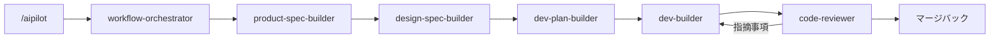

<p align="center">
  
</p>

<h1 align="center">AIPilot</h1>

<p align="center">
  コーディングエージェントのためのドキュメント駆動・ステージゲート型プロダクト開発ワークフロー。
</p>

<p align="center">
  
  
  
</p>

<p align="center">
  <a href="../README.md">English</a> | <a href="README_zh-CN.md">中文</a> | 日本語 | <a href="README_es-ES.md">Español</a>
</p>

AIPilot は、AI コーディングエージェント向けの専門的なワークフロースキル群であり、日常のソフトウェア開発を自動化および構造化します。要件の定義、設計上の決定、実行可能な計画の作成、コードの実装、結果のレビュー、承認された更新のプロジェクトドキュメントへのマージといったプロダクト開発を、検査可能なステージゲートプロセスに変換します。単一のエントリポイントから開始すると、AIPilot はプロジェクトの状態を自動的に検査し、適切なスキルに作業をルーティングします。

[ezreview](https://github.com/JililiDD/ezreview) と連携することで、AIPilot は Markdown ドキュメントをブラウザレビュー用の対話型 HTML ページとしてレンダリングします。ブラウザ上で特定の見出し、段落、インターフェース要素に直接注釈を追加できます。AIPilot はフィードバックを Markdown ソースに適用し、HTML プレビューを更新して、最終承認が得られるまでレビューサイクルを維持します。

## AIPilot のインストール

### Claude Code

```bash
claude plugin marketplace add JililiDD/aipilot
claude plugin install aipilot@aipilot
```

### Codex

```bash
codex plugin marketplace add JililiDD/aipilot
codex plugin add aipilot@aipilot
```

### Grok Build

```bash
grok plugin install JililiDD/aipilot@v1.0.0 --trust
```

## 単一エントリポイントの使用

スキルを手動で選択する必要はありません。`workflow-orchestrator` は現在のプロジェクト状態を読み取り、中断された記録を回復し、各ステージに必要なスキルに作業を自動的にルーティングします。

スラッシュコマンドまたは自然言語プロンプトを使用して作業を開始または再開します：

```text
/aipilot TODOリストアプリを構築する
```
*または*
```text
AIPilot を使用して TODO リストアプリを構築する。
```

**Codex** では、プラグインリストから AIPilot を選択するか、エントリポイントとして `Aipilot: Workflow Orchestrator` を選択します。



* **スマートなステージルーティング:** ユーザーインターフェースのないタスクでは、ビジュアルデザイン（`design-spec-builder`）は自動的にスキップされます。パッケージング、デプロイ、公開配布、または最終ハンドオフが必要な場合、リリース準備（Release Readiness）が利用可能になります。
* **ヒューマンインザループ・レビュー:** AIPilot はデフォルトでステージの境界で一時停止し、次のスキルが開始する前に各ドキュメントをレビューできるようにします。これにより、間違って理解された要件が誤った実装になることを防ぎます。

## ezreview を使用した HTML でのドキュメントレビュー（オプション）

AIPilot は [ezreview](https://github.com/JililiDD/ezreview) と連携し、プロダクト仕様、設計仕様、計画、および UI プロトタイプ向けの対話型ブラウザレビューサイクルを提供します。

1. **トークン消費ゼロのレンダリング:** AIPilot は、API トークンを消費することなく [marked](https://github.com/markedjs/marked) を使用して Markdown ソースを一時的な HTML ファイルにローカル変換します。
2. **ブラウザ内注釈:** `ezreview` は注釈ツールを備えたページを開き、特定の見出し、段落、または UI 要素にコメントを添付できるようにします。
3. **自動更新:** AIPilot はフィードバックを Markdown ソースに直接適用し、注釈に返信して、次のパスのために HTML プレビューを再読み込みします。
4. **承認とクリーンアップ:** 最終承認を与えるまでサイクルが繰り返されます。Markdown は単一の信頼できる情報源（Single Source of Truth）として維持され、レビュー終了時に一時 HTML ファイルはセッションスクラッチパッドから削除されます（ビジュアルデザイン成果物として保持する場合を除く）。

## 各スキルの役割

ワークフローオーケストレーターはプロジェクトの状態に基づいてこれらのスキルを自動的に選択しますが、必要に応じて任意のスキルを直接呼び出すこともできます。

| スキル | 役割 |
| --- | --- |
| [`workflow-orchestrator`](../skills/workflow-orchestrator/SKILL.md) | ワークフローステージのオーケストレーション、プロジェクト状態の追跡、確認ゲートの管理、および承認された作業のマージ |
| [`product-spec-builder`](../skills/product-spec-builder/SKILL.md) | 構造化インタビューを通じて要件、スコープ、動作、データ境界、および受入基準を明確化 |
| [`design-spec-builder`](../skills/design-spec-builder/SKILL.md) | 抽象的な視覚的方向性を具体的なレイアウト、タイポグラフィ、コンポーネント相互作用、設計決定に変換 |
| [`dev-plan-builder`](../skills/dev-plan-builder/SKILL.md) | 順序付けられたタスク、再利用戦略、および検証テスト計画を備えた実行可能なフェーズロードマップを構築 |
| [`dev-builder`](../skills/dev-builder/SKILL.md) | 承認された計画を実装し、実行証拠を収集し、テスト/ビルド失敗時に根本原因を診断 |
| [`code-reviewer`](../skills/code-reviewer/SKILL.md) | 要件仕様、設計ガイドライン、実装計画、およびテスト証拠に対してクリーンなコンテキストでコードレビューを実施 |
| [`release-builder`](../skills/release-builder/SKILL.md) | パッケージング、権限、プライバシーコンプライアンス、リリースノート、およびデプロイ準備を検証 |
| [`note-keeper`](../skills/note-keeper/SKILL.md) | アーキテクチャ上の決定、発見された落とし穴、およびプロジェクトガイドラインを永続メモリに記録 |
| [`java-backend-expert`](../skills/java-backend-expert/SKILL.md) | すべてのステージにわたって Spring Boot、REST API、JPA/SQL、および JVM アーキテクチャの専門的判断を提供 |

## 会話間でのプロジェクトメモリの保持

AIPilot はプロジェクトドキュメントに永続的なコンテキストを保存します。`workflow-orchestrator` は、以降のセッションが開始されたときにメモリファイルを読み取ります。

### `memory/decisions.md` は将来の作業を形作る選択を記録します

将来の実装を制約し、プロダクトや設計の仕様でまだ明確になっていない技術的またはアーキテクチャ上の選択に `memory/decisions.md` を使用します。例としては、サービス境界、永続化戦略、認証モデル、トランザクション境界、プロダクトの長期的な設計方向性を変更する決定などがあります。

プロジェクトが新しい選択に置き換えた場合でも、決定は履歴として残ります。記録を書き換える代わりに、以降のエントリが古い選択を上書きします。

### `memory/lessons.md` は制約と落とし穴を記録します

実装、診断、または統合作業を通じて発見された事実には `memory/lessons.md` を使用します。例としては、サードパーティ API の制限、未ドキュメントの SDK の動作、ビルドシステムの罠、プラットフォーム権限要件、将来の作業が遵守すべきリポジトリの規約などがあります。

レッスンにより、以降のセッションがデバッグの繰り返しを通じて同じ失敗を再発見することを防ぎます。

### `memory/agent-guideline.md` はワークフローの改善を記録します

AIPilot がどのように計画、質問、停止、レビュー、または報告を行うべきかに関するプロジェクト固有の指示には `memory/agent-guideline.md` を使用します。これらのルールは、全リポジトリで AIPilot を変更することなく、このプロジェクトのワークフローを変更します。

ワークフローに欠陥がある場合は、変更すべき内容を AIPilot に伝え、意図を永続化させます。例：

```text
For this project, always show API contract changes before writing the implementation plan. Remember this as a workflow rule.
```

## AIPilot プロジェクトドキュメントの保存場所の選択

最初の AIPilot 実行でプロジェクトが初期化され、ドキュメントの保存場所が尋ねられます。プロジェクト内に保持するには `docs/aipilot/` を受け入れるか、任意のカスタムディレクトリを指定します。

カスタムディレクトリはリポジトリの内部または外部に配置できます。外部ドキュメントルートの場合、AIPilot はプロジェクト名のサブフォルダーを作成して、複数のプロジェクトで 1 つの親ディレクトリを共有できます。外部ドキュメントは Git ブランチやリポジトリのクローンと一緒に移動しないため、個別ストレージが意図的である場合にのみそのオプションを選択してください。

AIPilot は解決された場所をプロジェクトルートの `AGENTS.md` 内の `## AIPilot` 見出しに書き込みます。以降のセッションでは、プロジェクト状態を開く前にそのポインターを読み取ります。デフォルトのレイアウトは次のとおりです：

```text
docs/aipilot/
├── product-spec.md
├── design-spec.md
├── dev-phase-plan.md
├── memory/               # 最初のメモリが記録されたときに生成
│   ├── decisions.md
│   ├── lessons.md
│   └── agent-guideline.md
├── design-assets/
└── work-items/
    ├── active-change.md
    └── merged/
```

マスター仕様書は承認されたプロダクト状態を説明します。アクティブなワークアイテムは、レビューが完了するまで保留中の Requirement、Design、Plan、および Execution Record を所有します。マージバックによりマスタードキュメントが更新され、完了したワークアイテムが `work-items/merged/` に移動します。

コールドスタートにより `work-items/`、`work-items/merged/`、および `design-assets/` が作成されます。`memory/` ディレクトリは遅延生成され、最初のメモリを記録するスキルが対応する Markdown ファイルおよび必要な見出しと一緒に作成します。

## サードパーティソフトウェア

AIPilot には、オフラインドキュメントレビュー用に MIT ライセンスの 2 つのコンポーネントが含まれています：

- [ezreview](https://github.com/JililiDD/ezreview) `0.2.2` レビュー可能な HTML を開き、要素にアンカーされた注釈を返します
- [marked](https://github.com/markedjs/marked) `18.0.6` 実行時のダウンロードなしで Markdown をレンダリングします

ソースとライセンスの詳細については [`THIRD_PARTY_NOTICES.md`](../THIRD_PARTY_NOTICES.md) を参照してください。
